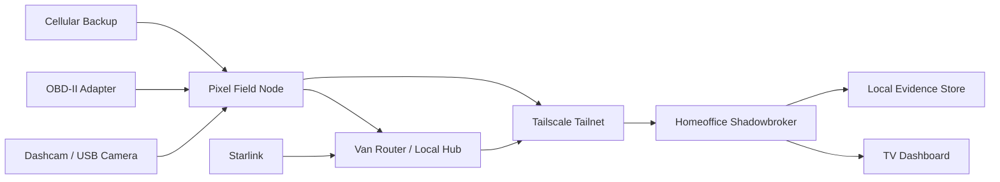

# Mobile And Van Architecture

This document defines the Pixel field node, van collection stack, Starlink uplink, and private tailnet integration.

## Goals

- Collect lawful first-party field intelligence while driving, estimating, selling, and servicing.
- Keep the van connected to the homeoffice Shadowbroker stack through the tailnet.
- Turn dashcam, GPS, sensors, and operator notes into searchable field observations.
- Avoid covert recording, platform abuse, and unnecessary personal-data retention.

## System Diagram

## Pixel Field Node

Recommended roles:

- Primary collector for GPS tracks, media, field notes, call metadata, meeting notes with consent, and task checklists.
- Uplink client over cellular, van Wi-Fi, or Starlink.
- Local queue when the network is unavailable.
- Authentication device for operator-only dashboard actions.

Useful sensors and data:

- GPS, heading, speed, accelerometer, gyroscope, magnetometer, barometer when present, camera, microphone with consent, Bluetooth proximity, Wi-Fi network state, cellular state, battery, charging state, USB connection, and time.
- Android location history should be treated as sensitive and minimized.

Recommended apps/components:

- Tailscale for private network access.
- Termux or a small Android companion app for local collectors.
- Syncthing or custom HTTPS upload for local media queue.
- Android Debug Bridge only during development, not as the production trust path.
- A locked-down work profile if this becomes a primary comms device.

## Dashcam Mode

Supported capture ideas:

- Continuous rolling buffer with event bookmarks.
- Manual bookmark button during field activity.
- GPS track synchronized with clips.
- Snapshot capture for public road conditions, jobsite context, signs, property exterior, and route conditions where lawful.
- Collision, hard braking, and rapid turn events from accelerometer.

Retention:

- Rolling raw video should expire quickly unless bookmarked.
- Bookmarked clips should store reason, location, timestamp, and operator.
- Faces, plates, and private-property details should be redacted before broad internal sharing when practical.

## Sales Meeting Mode

Allowed mode:

- Meeting notes, photos, recordings, and transcripts only when consent and local law requirements are satisfied.
- The app should visibly show recording state.
- Each meeting record should include consent status, participants or business names, purpose, and retention.

Avoid:

- Covert audio recording.
- Uploading contacts, private messages, or full call history unless clearly needed and allowed.
- Mixing family/personal data with business intel.

## Van Network

Suggested topology:

- Van router provides Wi-Fi LAN.
- Starlink feeds the router when available.
- Pixel connects to van Wi-Fi but can fall back to cellular.
- Tailscale runs on Pixel and any van compute node.
- Homeoffice stack remains the system of record.

Future hardware options:

- Small fanless mini PC or Raspberry Pi-class node for local buffering.
- USB SSD for encrypted local video cache.
- OBD-II BLE adapter for vehicle telemetry.
- External GNSS receiver for better GPS accuracy.
- Physical bookmark button mounted near the driver.

## Data Flow

1. Capture event on Pixel or van node.
2. Write encrypted local queue.
3. Attach metadata: timestamp, location, device id, source, and consent/collection mode.
4. Upload over tailnet when available.
5. Homeoffice backend normalizes into `field_observation`.
6. Dashboard links observations to parcels, routes, permits, leads, and meetings.
7. Retention job expires raw material that was not promoted to evidence.

## Security Controls

- Device disk encryption required.
- Strong device lock and remote wipe enabled.
- Tailscale ACLs restrict field node access to necessary services.
- Upload endpoints require operator authentication.
- Raw media store is not exposed to the public web.
- Every upload has source id and collection mode.
- Meeting recordings require a consent flag before upload.
